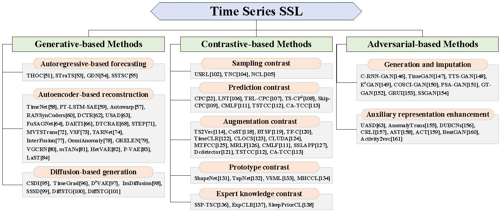
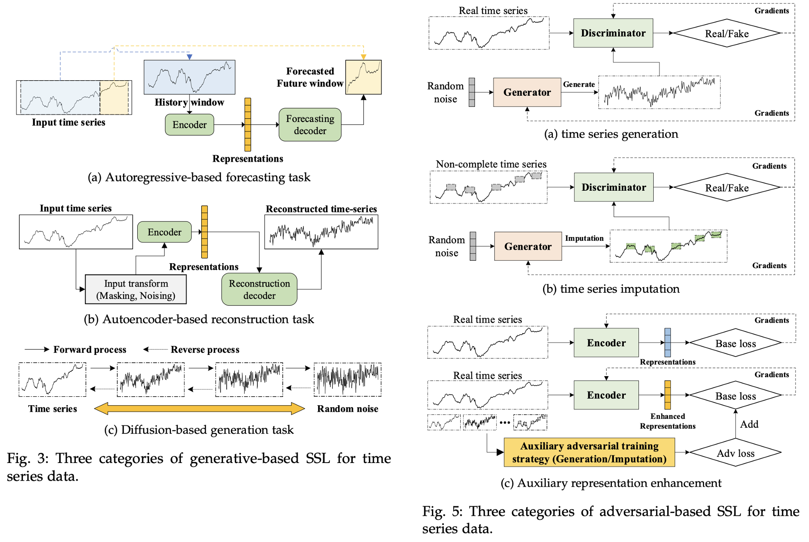
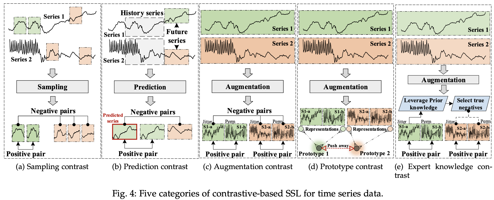

# Awesome Self-Supervised Learning for Time Series (SSL4TS)


[](https://awesome.re) 
 

[](https://badges.pufler.dev/visits/qingsongedu/awesome-self-supervised-learning-timeseries)
<!--  -->


A professionally curated list of awesome resources (paper, code, data, etc.) on **Self-Supervised Learning for Time Series (SSL4TS)**, which is the first work to comprehensively and systematically summarize the recent advances of Self-Supervised Learning for modeling time series data to the best of our knowledge.

We will continue to update this list with the newest resources. If you find any missed resources (paper/code) or errors, please feel free to open an issue or make a pull request.

For general **AI for Time Series (AI4TS)** Papers, Tutorials, and Surveys at the **Top AI Conferences and Journals**, please check [This Repo](https://github.com/qingsongedu/awesome-AI-for-time-series-papers). 

 
## Survey paper

[**Self-Supervised Learning for Time Series Analysis: Taxonomy, Progress, and Prospects**](https://arxiv.org/abs/2306.10125)  

Kexin Zhang, [Qingsong Wen](https://sites.google.com/site/qingsongwen8/), Chaoli Zhang, Rongyao Cai, Ming Jin, Yong Liu, James Zhang, [Yuxuan Liang](https://yuxuanliang.com/), [Guansong Pang](https://sites.google.com/site/gspangsite), [Dongjin Song](https://songdj.github.io/), [Shirui Pan](https://shiruipan.github.io/).

#### If you find this repository helpful for your work, please kindly cite our survey paper.

```bibtex
@article{zhang2023ssl4ts,
  title={Self-Supervised Learning for Time Series Analysis: Taxonomy, Progress, and Prospects},
  author={Kexin Zhang and Qingsong Wen and Chaoli Zhang and Rongyao Cai and Ming Jin and Yong Liu and James Zhang and Yuxuan Liang and Guansong Pang and Dongjin Song and Shirui Pan}
  journal={arXiv preprint arXiv:2306.10125},
  year={2023}
}
```

## Taxonomy of Self-Supervised Learning for Time Series
<!--  -->
 <br />

<!--  -->
 <br />

<!--  -->
 <br />


## Category of Self-Supervised Learning for Time Series

### Generative-based Methods on SSL4TS

In this category, the pretext task is to generate the expected data based on a given view of the data. In the context of time series modeling, the commonly used pretext tasks include using the past series to forecast the future windows or specific time stamps, using the encoder and decoder to reconstruct the input, and forecasting the unseen part of the masked time series. This section sorts out the existing self-supervised representation learning methods in time series modeling from the perspectives of autoregressive-based forecasting, autoencoder-based reconstruction, and diffusion-based generation. It should be noted that autoencoder-based reconstruction task is also viewed as an unsupervised framework. In the context of SSL, we mainly use the reconstruction task as a pretext task, and the final goal is to obtain the representations through autoencoder models. The illustration of the generative-based SSL for time series is shown in Fig. 3.

#### Autoregressive-based forecasting

- Timeseries anomaly detection using temporal hierarchical one-class network, in *NeurIPS*, 2020. [\[paper\]](https://dl.acm.org/doi/abs/10.5555/3495724.3496816)
- Self-supervised transformer for sparse and irregularly sampled multivariate clinical time-series, in *ACM Transactions on Knowledge Discovery from Data*, 2022. [\[paper\]](https://dl.acm.org/doi/10.1145/3516367)
- Graph neural network-based anomaly detection in multivariate time series, in *AAAI*, 2021. [\[paper\]](https://ojs.aaai.org/index.php/AAAI/article/view/16523)
- Semisupervised time series classification model with self-supervised learning, in *Engineering Applications of Artificial Intelligence*, 2022. [\[paper\]](https://www.sciencedirect.com/science/article/abs/pii/S0952197622003633)

#### Autoencoder-based reconstruction

- TimeNet: Pre-trained deep recurrent neural network for time series classification, in *arXiv*, 2017. [\[paper\]](https://arxiv.org/abs/1706.08838)
- Unsupervised pre-training of a deep LSTM-based stacked autoencoder for multivariate time series forecasting problems, in *Scientific Reports*, 2019. [\[paper\]](https://www.nature.com/articles/s41598-019-55320-6)
- Autowarp: Learning a warping distance from unlabeled time series using sequence autoencoders, in *NeurIPS*, 2018. [\[paper\]](https://dl.acm.org/doi/10.5555/3327546.3327715)
- Practical approach to asynchronous multivariate time series anomaly detection and localization, in *KDD*, 2021. [\[paper\]](https://dl.acm.org/doi/10.1145/3447548.3467174)
- Learning representations for time series clustering, in *NeurIPS*, 2019. [\[paper\]](https://papers.nips.cc/paper_files/paper/2019/hash/1359aa933b48b754a2f54adb688bfa77-Abstract.html)
- USAD: Unsupervised anomaly detection on multivariate time series, in *KDD*, 2020 [\[paper\]](https://dl.acm.org/doi/10.1145/3394486.3403392)
- Learning sparse latent graph representations for anomaly detection in multivariate time series, in *KDD*, 2022. [\[paper\]](https://dl.acm.org/doi/10.1145/3534678.3539117)
- Wind turbine fault detection using a denoising autoencoder with temporal information, in *IEEE/ASME Transactions on Mechatronics*, 2018 [\[paper\]](https://ieeexplore.ieee.org/document/8059861)
- Denoising temporal convolutional recurrent autoencoders for time series classification, in *Information Sciences*, 2022. [\[paper\]](https://www.sciencedirect.com/science/article/abs/pii/S0020025521012822)
- Pre-training enhanced spatial-temporal graph neural network for multivariate time series forecasting, in *KDD*, 2022. [\[paper\]](https://dl.acm.org/doi/10.1145/3534678.3539396)
- A transformer-based framework for multivariate time series representation learning, in *KDD*, 2021. [\[paper\]](https://dl.acm.org/doi/10.1145/3447548.3467401)
- Multi-variate time series forecasting on variable subsets, in *KDD*, 2022. [\[paper\]](https://dl.acm.org/doi/10.1145/3534678.3539394)
- TARNet: Task-aware reconstruction for time-series transformer, in *KDD*, 2022. [\[paper\]](https://dl.acm.org/doi/10.1145/3534678.3539329)
- Learning latent seasonal-trend representations for time series forecasting, in *NeurIPS*, 2022. [\[paper\]](https://papers.nips.cc/paper_files/paper/2022/hash/fd6613131889a4b656206c50a8bd7790-Abstract-Conference.html) [\[repo\]](https://github.com/zhycs/LaST)
- Multivariate time series anomaly detection and interpretation using hierarchical inter-metric and temporal embedding, in *KDD*, 2021. [\[paper\]](https://dl.acm.org/doi/10.1145/3447548.3467075)
- Robust anomaly detection for multivariate time series through stochastic recurrent neural network, in *KDD*, 2019. [\[paper\]](https://dl.acm.org/doi/10.1145/3292500.3330672)
- GRELEN: Multivariate time series anomaly detection from the perspective of graph relational learning, in *IJCAI*, 2022. [\[paper\]](https://www.ijcai.org/proceedings/2022/332)
- Deep variational graph convolutional recurrent network for multivariate time series anomaly detection, in *ICML*, 2022. [\[paper\]](https://proceedings.mlr.press/v162/chen22x.html)
- Heteroscedastic temporal variational autoencoder for irregularly sampled time series, in *ICLR*, 2022. [\[paper\]](https://openreview.net/forum?id=Az7opqbQE-3)
- Learning from irregularly-sampled time series: A missing data perspective, in *ICML*, 2020. [\[paper\]](https://arxiv.org/abs/2008.07599)

#### Diffusion-based generation

- CSDI: Conditional score-based diffusion models for probabilistic time series imputation, in *NeurIPS*, 2021. [\[paper\]](https://proceedings.neurips.cc/paper_files/paper/2021/hash/cfe8504bda37b575c70ee1a8276f3486-Abstract.html)
- Autoregressive denoising diffusion models for multivariate probabilistic time series forecasting, in *ICML*, 2021. [\[paper\]](https://icml.cc/virtual/2021/poster/8591)
- DiffSTG: Probabilistic spatio-temporal graph forecasting with denoising diffusion models, in *arXiv*, 2023. [\[paper\]](https://arxiv.org/abs/2301.13629)
- Diffload: Uncertainty quantification in load forecasting with diffusion model, in arXiv, 2023. [\[paper\]](https://arxiv.org/abs/2306.01001)
- Diffusion-based time series imputation and forecasting with structured state space models, in *Transactions on Machine Learning Research*, 2022. [\[paper\]](https://openreview.net/forum?id=hHiIbk7ApW)

### Contrastive-based Methods on SSL4TS
Contrastive learning is a widely used self-supervised learning strategy, showing a strong learning ability in computer vision and natural language processing. Unlike discriminative models that learn a mapping rule to true labels and generative models that try to reconstruct inputs, contrastive-based methods aim to learn data representations by contrasting between positive and negative samples. Specifically, positive samples should have similar representations, while negative samples have different representations. Therefore, the selection of positive samples and negative samples is very important to contrastive-based methods. This section sorts out and summarizes the existing contrastive-based methods in time series modeling according to the selection of positive and negative samples. The illustration of the contrastive-based SSL for time series is shown in Fig. 4.

#### Sampling contrast
- Unsupervised scalable representation learning for multivariate time series, in  *NeurIPS*, 2019. [\[paper\]](https://proceedings.neurips.cc/paper/2019/hash/53c6de78244e9f528eb3e1cda69699bb-Abstract.html)
- Unsupervised representation learning for time series with temporal neighborhood coding, in *ICLR*, 2021. [\[paper\]](https://openreview.net/forum?id=8qDwejCuCN)
- Neighborhood contrastive learning applied to online patient monitoring, in *ICML*, 2021. [\[paper\]](http://proceedings.mlr.press/v139/yeche21a.html)

#### Prediction contrast
- Oord, Aaron van den, Yazhe Li, and Oriol Vinyals. "Representation learning with contrastive predictive coding." arXiv preprint arXiv:1807.03748 (2018). [\[paper\]](https://arxiv.org/abs/1807.03748)
- Schneider, Tim, et al. "Detecting anomalies within time series using local neural transformations." arXiv preprint arXiv:2202.03944 (2022). [\[paper\]](https://arxiv.org/abs/2202.03944)
- Pranavan, Theivendiram, et al. "Contrastive predictive coding for anomaly detection in multi-variate time series data." arXiv preprint arXiv:2202.03639 (2022). [\[paper\]](https://arxiv.org/abs/2202.03639)
- Deldari, S., Smith, D. V., Xue, H., & Salim, F. D. (2021, April). Time series change point detection with self-supervised contrastive predictive coding. In Proceedings of the Web Conference 2021 (pp. 3124-3135). [\[paper\]](https://dl.acm.org/doi/abs/10.1145/3442381.3449903)
- Zhang, Kexin, et al. "Time Series Anomaly Detection using Skip-Step Contrastive Predictive Coding." NeurIPS 2022 Workshop: Self-Supervised Learning-Theory and Practice. 2022. [\[paper\]](https://sslneurips22.github.io/paper_pdfs/paper_19.pdf)
- Hou, M., Xu, C., Liu, Y., Liu, W., Bian, J., Wu, L., ... & Liu, T. Y. (2021, October). Stock trend prediction with multi-granularity data: A contrastive learning approach with adaptive fusion. In Proceedings of the 30th ACM International Conference on Information & Knowledge Management (pp. 700-709). [\[paper\]](https://dl.acm.org/doi/abs/10.1145/3459637.3482483)
- Eldele, Emadeldeen, Mohamed Ragab, Zhenghua Chen, Min Wu, Chee Keong Kwoh, Xiaoli Li, and Cuntai Guan. "Time-series representation learning via temporal and contextual contrasting." arXiv preprint arXiv:2106.14112 (2021). [\[paper\]](https://arxiv.org/abs/2106.14112)
- Eldele, E., Ragab, M., Chen, Z., Wu, M., Kwoh, C. K., Li, X., & Guan, C. (2022). Self-supervised contrastive representation learning for semi-supervised time-series classification. arXiv preprint arXiv:2208.06616. [\[paper\]](https://arxiv.org/abs/2208.06616)


#### Augmentation contrast
- Yue, Z., Wang, Y., Duan, J., Yang, T., Huang, C., Tong, Y., & Xu, B. (2022, June). Ts2vec: Towards universal representation of time series. In Proceedings of the AAAI Conference on Artificial Intelligence (Vol. 36, No. 8, pp. 8980-8987). [\[paper\]](https://ojs.aaai.org/index.php/AAAI/article/view/20881)
- Woo, G., Liu, C., Sahoo, D., Kumar, A., & Hoi, S. (2022). CoST: Contrastive learning of disentangled seasonal-trend representations for time series forecasting. arXiv preprint arXiv:2202.01575. [\[paper\]](https://arxiv.org/abs/2202.01575)
- Yang, Ling, and Shenda Hong. "Unsupervised time-series representation learning with iterative bilinear temporal-spectral fusion." International Conference on Machine Learning. PMLR, 2022. [\[paper\]](https://proceedings.mlr.press/v162/yang22e.html)
- Zhang, Xiang, Ziyuan Zhao, Theodoros Tsiligkaridis, and Marinka Zitnik. "Self-supervised contrastive pre-training for time series via time-frequency consistency." Advances in Neural Information Processing Systems 35 (2022): 3988-4003. [\[paper\]](https://proceedings.neurips.cc/paper_files/paper/2022/hash/194b8dac525581c346e30a2cebe9a369-Abstract-Conference.html)
- Yang, Xinyu, Zhenguo Zhang, and Rongyi Cui. "Timeclr: A self-supervised contrastive learning framework for univariate time series representation." Knowledge-Based Systems 245 (2022): 108606. [\[paper\]](https://www.sciencedirect.com/science/article/abs/pii/S0950705122002726)
- Kiyasseh, Dani, Tingting Zhu, and David A. Clifton. "Clocs: Contrastive learning of cardiac signals across space, time, and patients." International Conference on Machine Learning. PMLR, 2021. [\[paper\]](https://proceedings.mlr.press/v139/kiyasseh21a.html)
- Ozyurt, Yilmazcan, Stefan Feuerriegel, and Ce Zhang. "Contrastive learning for unsupervised domain adaptation of time series." arXiv preprint arXiv:2206.06243 (2022). [\[paper\]](https://arxiv.org/abs/2206.06243)
- Zhang, K., Liu, Y., Gu, Y., Wang, J., & Ruan, X. (2022). Valve Stiction Detection Using Multitimescale Feature Consistent Constraint for Time-Series Data. IEEE/ASME Transactions on Mechatronics. [\[paper\]](https://ieeexplore.ieee.org/abstract/document/10001758)
- Hou, M., Xu, C., Li, Z., Liu, Y., Liu, W., Chen, E., & Bian, J. (2022, April). Multi-Granularity Residual Learning with Confidence Estimation for Time Series Prediction. In Proceedings of the ACM Web Conference 2022 (pp. 112-121). [\[paper\]](https://dl.acm.org/doi/abs/10.1145/3485447.3512056)
- Hou, M., Xu, C., Liu, Y., Liu, W., Bian, J., Wu, L., ... & Liu, T. Y. (2021, October). Stock trend prediction with multi-granularity data: A contrastive learning approach with adaptive fusion. In Proceedings of the 30th ACM International Conference on Information & Knowledge Management (pp. 700-709). [\[paper\]](https://dl.acm.org/doi/abs/10.1145/3459637.3482483)
- Lee, Harim, Eunseon Seong, and Dong-Kyu Chae. "Self-supervised learning with attention-based latent signal augmentation for sleep staging with limited labeled data." Proceedings of the Thirty-First International Joint Conference on Artificial Intelligence, IJCAI-22, LD Raedt, Ed. International Joint Conferences on Artificial Intelligence Organization. Vol. 7. 2022. [\[paper\]](https://www.ijcai.org/proceedings/2022/0537.pdf)
- Yang, Y., Zhang, C., Zhou, T., Wen, Q., & Sun, L. (2023). DCdetector: Dual Attention Contrastive Representation Learning for Time Series Anomaly Detection. arXiv preprint arXiv:2306.10347. [\[paper\]](https://arxiv.org/abs/2306.10347)
- Eldele, Emadeldeen, Mohamed Ragab, Zhenghua Chen, Min Wu, Chee Keong Kwoh, Xiaoli Li, and Cuntai Guan. "Time-series representation learning via temporal and contextual contrasting." arXiv preprint arXiv:2106.14112 (2021). [\[paper\]](https://arxiv.org/abs/2106.14112)
- Eldele, E., Ragab, M., Chen, Z., Wu, M., Kwoh, C. K., Li, X., & Guan, C. (2022). Self-supervised contrastive representation learning for semi-supervised time-series classification. arXiv preprint arXiv:2208.06616. [\[paper\]](https://arxiv.org/abs/2208.06616)

#### Prototype contrast
- Li, G., Choi, B., Xu, J., Bhowmick, S. S., Chun, K. P., & Wong, G. L. H. (2021, May). Shapenet: A shapelet-neural network approach for multivariate time series classification. In Proceedings of the AAAI conference on artificial intelligence (Vol. 35, No. 9, pp. 8375-8383). [\[paper\]](https://ojs.aaai.org/index.php/AAAI/article/view/17018)
- Zhang, X., Gao, Y., Lin, J., & Lu, C. T. (2020, April). Tapnet: Multivariate time series classification with attentional prototypical network. In Proceedings of the AAAI Conference on Artificial Intelligence (Vol. 34, No. 04, pp. 6845-6852). [\[paper\]](https://ojs.aaai.org/index.php/AAAI/article/view/6165)
- Dorle, A., Li, F., Song, W., & Li, S. (2020, October). Learning discriminative virtual sequences for time series classification. In Proceedings of the 29th ACM International Conference on Information & Knowledge Management (pp. 2001-2004). [\[paper\]](https://dl.acm.org/doi/abs/10.1145/3340531.3412099)
- Meng, Q., Qian, H., Liu, Y., Cui, L., Xu, Y., & Shen, Z. (2023, June). MHCCL: Masked Hierarchical Cluster-Wise Contrastive Learning for Multivariate Time Series. In Proceedings of the AAAI Conference on Artificial Intelligence (Vol. 37, No. 8, pp. 9153-9161). [\[paper\]](https://ojs.aaai.org/index.php/AAAI/article/view/26098)

#### Expert knowledge contrast
- Self-supervised pre-training for time series classification, in *IJCNN*, 2021. [\[paper\]](https://ieeexplore.ieee.org/abstract/document/9533426)
- Utilizing expert features for contrastive learning of time-series representations，in *ICML*, 2022. [\[paper\]](https://proceedings.mlr.press/v162/nonnenmacher22a.html)
- SleepPriorCL: Contrastive representation learning with prior knowledge-based
positive mining and adaptive temperature for sleep staging, in *arXiv*, 2021. [\[paper\]](https://arxiv.org/abs/2110.09966)


### Adversarial-based Methods on SSL4TS
Adversarial-based self-supervised representation learning methods utilize generative adversarial networks (GANs) to construct pretext tasks. GAN contains a generator $\mathcal{G}$ and a discriminator $\mathcal{D}$. The generator $\mathcal{G}$ is responsible for generating synthetic data similar to real data, while the discriminator $\mathcal{D}$ is responsible for determining whether the generated data is real data or synthetic data. Therefore, the goal of the generator is to maximize the decision failure rate of the discriminator, and the goal of the discriminator is to minimize its failure rate. According to the final task, the existing adversarial-based representation learning methods can be divided into time series generation and imputation, and auxiliary representation enhancement. The illustration of the adversarial-based SSL for time series is shown in Fig. 5.


#### Time series generation and imputation

- Mogren, O. (2016). C-RNN-GAN: Continuous recurrent neural networks with adversarial training. arXiv preprint arXiv:1611.09904. [\[paper\]](https://arxiv.org/abs/1611.09904)
- Yoon, J., Jarrett, D., & Van der Schaar, M. (2019). Time-series generative adversarial networks. Advances in neural information processing systems, 32. [\[paper\]](https://proceedings.neurips.cc/paper_files/paper/2019/hash/c9efe5f26cd17ba6216bbe2a7d26d490-Abstract.html)
- Li, X., Metsis, V., Wang, H., & Ngu, A. H. H. (2022, June). Tts-gan: A transformer-based time-series generative adversarial network. In International Conference on Artificial Intelligence in Medicine (pp. 133-143). Cham: Springer International Publishing. [\[paper\]](https://link.springer.com/chapter/10.1007/978-3-031-09342-5_13)
- Luo, Y., Zhang, Y., Cai, X., & Yuan, X. (2019, August). E2gan: End-to-end generative adversarial network for multivariate time series imputation. In Proceedings of the 28th international joint conference on artificial intelligence (pp. 3094-3100). Palo Alto, CA, USA: AAAI Press. [\[paper\]](https://www.ijcai.org/Proceedings/2019/0429.pdf)
- Seyfi, Ali, Jean-Francois Rajotte, and Raymond Ng. "Generating multivariate time series with COmmon Source CoordInated GAN (COSCI-GAN)." Advances in Neural Information Processing Systems 35 (2022): 32777-32788. [\[paper\]](https://proceedings.neurips.cc/paper_files/paper/2022/hash/d3408794e41dd23e34634344d662f5e9-Abstract-Conference.html)
- Jeha, P., Bohlke-Schneider, M., Mercado, P., Kapoor, S., Nirwan, R. S., Flunkert, V., ... & Januschowski, T. (2021, October). PSA-GAN: Progressive self attention GANs for synthetic time series. In International Conference on Learning Representations. [\[paper\]](https://openreview.net/forum?id=Ix_mh42xq5w)
- Jeon, J., Kim, J., Song, H., Cho, S., & Park, N. (2022). GT-GAN: General Purpose Time Series Synthesis with Generative Adversarial Networks. Advances in Neural Information Processing Systems, 35, 36999-37010. [\[paper\]](https://proceedings.neurips.cc/paper_files/paper/2022/hash/f03ce573aa8bce26f77b76f1cb9ee979-Abstract-Conference.html)
- Luo, Y., Cai, X., Zhang, Y., & Xu, J. (2018). Multivariate time series imputation with generative adversarial networks. Advances in neural information processing systems, 31. [\[paper\]](https://proceedings.neurips.cc/paper_files/paper/2018/hash/96b9bff013acedfb1d140579e2fbeb63-Abstract.html)
- Miao, X., Wu, Y., Wang, J., Gao, Y., Mao, X., & Yin, J. (2021, May). Generative semi-supervised learning for multivariate time series imputation. In Proceedings of the AAAI conference on artificial intelligence (Vol. 35, No. 10, pp. 8983-8991). [\[paper\]](https://ojs.aaai.org/index.php/AAAI/article/view/17086)

#### Auxiliary representation enhancement
- Audibert, J., Michiardi, P., Guyard, F., Marti, S., & Zuluaga, M. A. (2020, August). Usad: Unsupervised anomaly detection on multivariate time series. In Proceedings of the 26th ACM SIGKDD international conference on knowledge discovery & data mining (pp. 3395-3404). [\[paper\]](https://dl.acm.org/doi/abs/10.1145/3394486.3403392)
- Xu, J., Wu, H., Wang, J., & Long, M. (2021). Anomaly transformer: Time series anomaly detection with association discrepancy. arXiv preprint arXiv:2110.02642. [\[paper\]](https://arxiv.org/abs/2110.02642)
- Zhu, D., Song, D., Chen, Y., Lumezanu, C., Cheng, W., Zong, B., ... & Chen, H. (2020, April). Deep unsupervised binary coding networks for multivariate time series retrieval. In Proceedings of the AAAI Conference on Artificial Intelligence (Vol. 34, No. 02, pp. 1403-1411). [\[paper\]](https://ojs.aaai.org/index.php/AAAI/article/view/5497)
- Ma, Q., Zheng, J., Li, S., & Cottrell, G. W. (2019). Learning representations for time series clustering. Advances in neural information processing systems, 32. [\[paper\]](https://proceedings.neurips.cc/paper/2019/hash/1359aa933b48b754a2f54adb688bfa77-Abstract.html)
- Wu, S., Xiao, X., Ding, Q., Zhao, P., Wei, Y., & Huang, J. (2020). Adversarial sparse transformer for time series forecasting. Advances in neural information processing systems, 33, 17105-17115. [\[paper\]](https://proceedings.neurips.cc/paper/2020/hash/c6b8c8d762da15fa8dbbdfb6baf9e260-Abstract.html?ref=https://githubhelp.com)
- Li, Y., Wang, H., Li, J., Liu, C., & Tan, J. (2022, July). ACT: Adversarial Convolutional Transformer for Time Series Forecasting. In 2022 International Joint Conference on Neural Networks (IJCNN) (pp. 1-8). IEEE. [\[paper\]](https://ieeexplore.ieee.org/abstract/document/9892791)
- Zhou, B., Liu, S., Hooi, B., Cheng, X., & Ye, J. (2019, August). Beatgan: Anomalous rhythm detection using adversarially generated time series. In IJCAI (Vol. 2019, pp. 4433-4439). [\[paper\]](https://www.ijcai.org/Proceedings/2019/0616.pdf)
- Aggarwal, K., Joty, S., Fernandez-Luque, L., & Srivastava, J. (2019, July). Adversarial unsupervised representation learning for activity time-series. In Proceedings of the AAAI Conference on Artificial Intelligence (Vol. 33, No. 01, pp. 834-841). [\[paper\]](https://aaai.org/ojs/index.php/AAAI/article/download/3870/3748)

## Applications and Datasets on SSL4TS
#### Anomaly Detection
|Dataset|Size|Dimension|Source|Link|Comment|
|:---:|:---:|:---:|:---:|:---:|:---|
|PSM|132,481 / 87,841|26|[[paper]](https://dl.acm.org/doi/10.1145/3447548.3467174)|[[link]](https://github.com/eBay/RANSynCoders)|AnRa: 27.80%|
|SMD|708,405 / 708,405|38|[[paper]](https://dl.acm.org/doi/10.1145/3292500.3330672)|[[link]](https://github.com/NetManAIOps/OmniAnomaly)|AnRa: 4.16%|
|MSL|58,317 / 73,729|55|[[paper]](https://dl.acm.org/doi/10.1145/3219819.3219845)|[[link]](https://github.com/khundman/telemanom)|AnRa: 10.72%|
|SMAP|135,183 / 427,617|25|[[paper]](https://dl.acm.org/doi/10.1145/3219819.3219845)|[[link]](https://github.com/khundman/telemanom)|AnRa: 13.13%|
|SWaT|475,200 / 449,919|51|[[paper]](https://link.springer.com/chapter/10.1007/978-3-319-71368-7_8)|[[link]](https://itrust.sutd.edu.sg/itrust-labs_datasets/dataset_info/)|AnRa: 12.98%|
|WADI|1,048,571 / 172,801|103|[[paper]](https://dl.acm.org/doi/10.1145/3055366.3055375)|[[link]](https://itrust.sutd.edu.sg/itrust-labs_datasets/dataset_info/)|AnRa: 5.99%|

#### Forecasting
|Dataset|Size|Dimension|Source|Link|Comment|
|:---:|:---:|:---:|:---:|:---:|:---|
|ETTh|17,420|7|[[paper]](https://ojs.aaai.org/index.php/AAAI/article/view/17325)|[[link]](https://github.com/zhouhaoyi/ETDataset)|SaIn: 1h|
|ETTm|69,680|7|[[paper]](https://ojs.aaai.org/index.php/AAAI/article/view/17325)|[[link]](https://github.com/zhouhaoyi/ETDataset)|SaIn: 15min|
|Wind|10,957|28|*Non*|[[link]](https://www.kaggle.com/datasets/sohier/30-years-of-european-wind-generation)|SaIn: 1day|
|Electricity|26,304|321|*Non*|[[link]](https://archive.ics.uci.edu/ml/datasets/ElectricityLoadDiagrams20112014)|SaIn: 1hour|
|ILI|966|7|*Non*|[[link]](https://gis.cdc.gov/grasp/fluview/fluportaldashboard.html)|SaIn: 1weak|
|Weather|52,696|21|*Non*|[[link]](https://www.bgc-jena.mpg.de/wetter/)|SaIn: 10min|
|Traffic|17,544|862|*Non*|[[link]](http://pems.dot.ca.gov/)|SaIn: 1hour|
|Exchange|7,588|8|[[paper]](https://dl.acm.org/doi/abs/10.1145/3209978.3210006)|[[link]](https://github.com/laiguokun/LSTNet)|SaIn: 1day|
|Solar|52,560|137|*Non*|[[link]](https://www.nrel.gov/grid/solar-power-data.html)|SaIn: 10min|

#### Classification and Clustering
|Dataset|Size|Dimension|Source|Link|Comment|
|:---:|:---:|:---:|:---:|:---:|:---|
|HAR|17,3056 / 173,056|9|[[paper]](https://web.archive.org/web/20210506171341id_/https://www.elen.ucl.ac.be/Proceedings/esann/esannpdf/es2013-84.pdf)|[[link]](https://archive.ics.uci.edu/ml/datasets/human+activity+recognition+using+smartphones)|Classes: 6|
|UCR 130|128*M|1|[[paper]](https://arxiv.org/pdf/1810.07758.pdf)|[[link]](https://www.cs.ucr.edu/~eamonn/time_series_data/)|N/A|
|UEA 30|30*M|D|[[paper]](https://arxiv.org/abs/1811.00075)|[[link]](https://www.timeseriesclassification.com/)|N/A|


## Time Series Related Survey
* Transformers in Time Series: A Survey, in *IJCAI* 2023. [[paper]](https://arxiv.org/abs/2202.07125) [[link]](https://github.com/qingsongedu/time-series-transformers-review)
* Time series data augmentation for deep learning: a survey, in *IJCAI* 2021. [\[paper\]](https://arxiv.org/abs/2002.12478)
* Neural temporal point processes: a review, in *IJCAI* 2021. [\[paper\]](https://arxiv.org/abs/2104.03528v5)
* Time-series forecasting with deep learning: a survey, in *Philosophical Transactions of the Royal Society A* 2021. [\[paper\]](https://royalsocietypublishing.org/doi/full/10.1098/rsta.2020.0209)
* Deep learning for time series forecasting: a survey, in *Big Data* 2021. [\[paper\]](https://www.liebertpub.com/doi/abs/10.1089/big.2020.0159)
* Neural forecasting: Introduction and literature overview, in *arXiv* 2020. [\[paper\]](https://arxiv.org/abs/2004.10240) 
* Deep learning for anomaly detection in time-series data: review, analysis, and guidelines, in *Access* 2021. [\[paper\]](https://ieeexplore.ieee.org/abstract/document/9523565) 
* A review on outlier/anomaly detection in time series data, in *ACM Computing Surveys* 2021. [\[paper\]](https://arxiv.org/abs/2002.04236)
* A unifying review of deep and shallow anomaly detection, in *Proceedings of the IEEE* 2021. [\[paper\]](http://128.84.4.34/abs/2009.11732)
* Deep learning for time series classification: a review, in *Data Mining and Knowledge Discovery* 2019. [\[paper\]](https://link.springer.com/article/10.1007/s10618-019-00619-1?sap-outbound-id=11FC28E054C1A9EB6F54F987D4B526A6EE3495FD&mkt-key=005056A5C6311EE999A3A1E864CDA986)
* More related time series surveys, tutorials, and papers can be found at this [repo](https://github.com/qingsongedu/awesome-AI-for-time-series-papers).

## Self-Supervised Learning Tutorial/Survey in Other Disciplines
* A cookbook of self-supervised learning, in *arXiv* 2023. [\[paper\]](https://arxiv.org/abs/2304.12210)
* Self-supervised Learning: Generative or Contrastive, in *TKDE* 2021. [\[paper\]](https://arxiv.org/abs/2006.08218)


